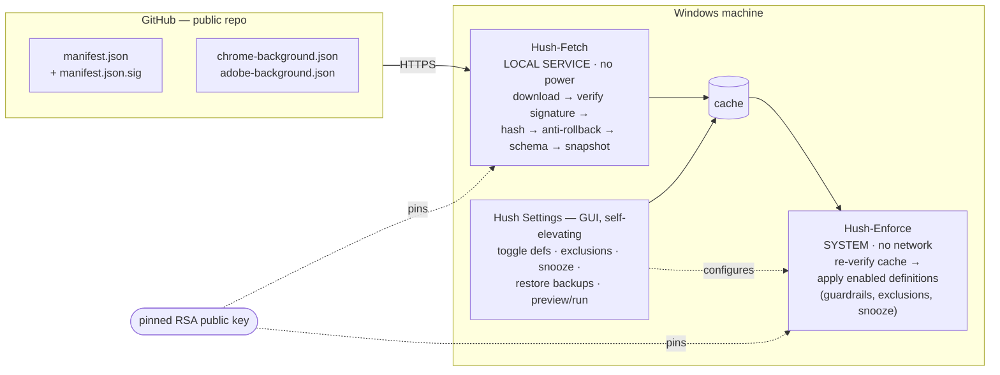

# Hush

**Stop background apps from running the show.**

Chrome staying "on" after you close the window. Adobe's updater chewing CPU
at 2am. Some autostart nobody remembers installing. Hush is a small, secure
Windows tool that watches for exactly the background noise you tell it to
watch for, and quietly closes or removes it — on a schedule, per machine,
from a catalog you control.

You maintain a list of policies ("definitions") in the separate public
`bardagi/hush-definitions` GitHub repo, pick which
ones apply to which machine, and Hush takes it from there.

> Example: enforce "close Chrome in the background" on your laptop and
> "close Adobe in the background" on your desktop — both served from the
> same central, signed catalog.

---

## Features

- **Pick what gets closed, per machine.** A small GUI lists every
  definition in the catalog — toggle the ones you want enforced here, leave
  the rest off. Same catalog, different behavior per machine.
- **Optional actions are opt-in.** Every action has a stable ID. Actions marked
  `optional` remain off until selected explicitly in the GUI.
- **Snooze it.** Mid-download, mid-meeting, mid-anything: snooze for 1
  hour, 4 hours, or until 7am. Or set recurring quiet hours (e.g. 9–17) so
  Hush stays out of your way automatically, no need to remember to snooze.
- **Exclude what you don't want touched.** A per-machine "never touch this"
  list for processes, services, or autostarts. It overrides everything
  else, including the definitions themselves.
- **Nothing reversible disappears for good.** Services, registry values, and
  autostarts record their prior state in a SYSTEM-owned journal. Disabling a
  definition or uninstalling asks for confirmation and restores those changes;
  process termination is explicitly non-reversible.
- **Preview before it runs.** See exactly what a definition would do — kill
  this process, stop that service, clear that registry key — before you let
  it touch anything.
- **One catalog, many machines.** Definitions live in a signed, public
  GitHub repo. Update the catalog once; every machine picks up the change
  on its next scheduled check (every 15 minutes, by default).
- **Safe to run as SYSTEM.** No arbitrary code execution, a signed and
  pinned catalog, non-overridable guardrails around critical OS processes
  and services, and fail-closed behavior the moment anything looks wrong.
  Details below.

---

## How it works



Two scheduled tasks split responsibility by privilege:

| Task | Runs as | Network? | Can stop processes? | Job |
|------|---------|----------|---------------------|-----|
| `Hush-Fetch`   | `LOCAL SERVICE` | yes | **no** | download, verify, cache |
| `Hush-Enforce` | `SYSTEM`        | **no** | yes | apply cached, re-verified policy |

The most-privileged component (SYSTEM) never touches the network; the
network-facing component has no power to change the system. The enforcer
**re-verifies the signed catalog** before trusting the cache, so even a
compromised fetcher cannot make SYSTEM apply forged instructions.

## Security model (why this is safe to run as SYSTEM)

- **Data, not code.** Definitions only describe allowlisted actions
  (`killProcess`, `stopService`, `removeAutostart`, `setRegistryValue`).
  There is no "run command" action, and `setRegistryValue` is itself
  locked down (see below) so it cannot be turned into code execution —
  only bounded, reversible changes.
- **Every JSON value is sanitised before use.** Each field that becomes a
  target is treated as hostile and canonicalised + allowlisted at the
  trust boundary (`Test-HushDefinition`, used by both fetcher and
  enforcer) *before* it touches a privileged operation: exact-match
  identifiers (process / service / registry names) must be plain strings
  with a safe charset and **no wildcards, quotes, path separators, control
  chars or invisible/look-alike Unicode**; service names reject wildcards
  (so `Win*` can't widen onto `WinDefend`); `data` must match its declared
  `valueType`; manifest `file` names are bare `*.json` (no `..\`
  traversal); `sha256` must be 64 hex. Any unsafe value **fails the whole
  definition closed**. The action helpers re-check the *resolved* targets
  again at run time (defence in depth).
- **Registry writes are guardrailed.** `setRegistryValue` is permitted
  **only** under `SOFTWARE\Policies\**`, and a non-overridable denylist
  always wins — Image File Execution Options, the `Run`/`RunOnce` keys,
  Winlogon, `AppInit_DLLs`, logon-script policies, `Services\*`,
  Defender/SmartScreen, etc. are refused even from a signed definition.
  (Disabling autoruns is the separate, reversible `removeAutostart`
  action, which is unaffected.)
- **Signed catalog, pinned key.** `manifest.json` is signed (RSA-2048 /
  SHA-256) and verified against a public key pinned in each machine's
  `config.json`. Every definition is SHA-256 checked against the signed
  manifest. The private key stays offline and should be kept in encrypted
  storage or a non-exportable signing certificate.
- **Fail-closed.** Bad download / bad signature / bad schema → keep the
  last verified cache and apply nothing new.
- **Anti-rollback and expiry.** Monotonic `catalogVersion` and
  `definitionVersion` values prevent replaying weaker policy. Catalogs also
  carry a signed expiry; an expired last-known-good catalog is retained but
  clearly reported until a fresh one is available.
- **Non-overridable guardrails.** Hush refuses to kill critical OS
  processes (lsass, csrss, winlogon, services, smss, …) or disable protected
  services (Defender, etc.) even if a signed definition asks.
- **Background-only actions.** A `killProcess` action can set
  `backgroundOnly: true`. Hush then checks the relevant interactive user
  session and skips the entire process tree if it owns a visible window. If
  that check is unavailable, Hush fails closed and skips the process.
- **Local exclusions.** A per-machine "never touch" list layered on top of
  the guardrails.
- **Hardened install.** `C:\ProgramData\Hush` is writable only by
  SYSTEM/Administrators (the cache adds write for LOCAL SERVICE only), with
  separate private ACLs for configuration, logs, backups, and the journal.
  Reparse points and unknown explicit ACEs are rejected before scripts are copied.
- **Auditable.** Every action → `logs\hush.log` and the `Hush` Windows
  Event Log source.

## Repo layout

```
Hush/
├─ install/   Install-Hush.ps1, Uninstall-Hush.ps1
├─ src/       Update-HushDefinitions.ps1 (fetcher), Invoke-Hush.ps1 (enforcer),
│             Hush.Common.ps1 (shared), config.example.json
├─ gui/       Hush-Settings.ps1 (WPF, self-elevating)
├─ tools/     New-HushSigningKey.ps1, Protect-HushManifest.ps1
└─ definitions/   local fixtures/examples only; live catalog is in
                  bardagi/hush-definitions
```

Requires only **Windows PowerShell 5.1** (built into Windows 10/11) — no
modules to install.

---

## Operator setup (one time)

1. **Make a signing key** on an offline signing machine:
   ```powershell
   .\tools\New-HushSigningKey.ps1 -OutDir .
   # -> hush-public.xml (pin this), hush-private.xml.dpapi (KEEP OFFLINE)
   ```
2. **Publish the definitions repo.** Put `manifest.json`,
   `manifest.json.sig`, and the authored `*.json` files in
   `bardagi/hush-definitions/definitions`. Keep its `.gitattributes` so git
   does not rewrite line endings (that would break hashes/signatures). Protect
   the default branch with pull requests and required validation checks.
3. **Sign the catalog** whenever you add/edit a definition:
   ```powershell
   .\tools\Protect-HushManifest.ps1 -DefinitionsDir .\definitions -PrivateKeyPath .\hush-private.xml.dpapi
   git add definitions ; git commit -m "update policy" ; git push
   ```
   This regenerates `manifest.json` + `manifest.json.sig`, increments the
   catalog version, and gives the signed catalog a 90-day validity window.
   Only the release signer should run this step and publish the resulting
   catalog commit.

## Per-machine install (elevated)

```powershell
.\install\Install-Hush.ps1 `
    -RepoRawBaseUrl 'https://raw.githubusercontent.com/bardagi/hush-definitions/main/definitions' `
    -PublicKeyPath  '.\hush-public.xml' `
    -EnabledDefinitions chrome-background      # optional starting selection
```

Then open **Start Menu → Hush Settings** (it self-elevates) — this is where
the features above live: choose which definitions to enforce, set
exclusions, snooze or set quiet hours, restore a backup, or preview/run a
definition right now.

`-PublicKeyPath` / `-PublicKeyXml` accept **more than one** key — pass
several to pin multiple public keys at once (see rotation below).

## Rotating the signing key

`Test-HushSignature` accepts several pinned keys and trusts a catalog if
**any** of them verifies, so you can rotate without a flag-day:

1. Generate a new keypair (`New-HushSigningKey.ps1`).
2. Re-run `Install-Hush.ps1` pinning **both** keys:
   `-PublicKeyPath .\hush-public-old.xml,.\hush-public-new.xml`.
3. Once every machine trusts both, sign the catalog with the **new**
   private key (`Protect-HushManifest.ps1 -PrivateKeyPath
   .\hush-private-new.xml.dpapi`) and push.
4. After the fleet has fetched at least once, re-run the installer pinning
   **only** the new key to retire the old one.

## Authoring a definition

A definition is declarative JSON. Required: `schemaVersion` (1), `name`,
`displayName`, `definitionVersion` (bump on every change), `updateDate`,
`description`, `actions`.

Action types:

| type | required | notes |
|------|----------|-------|
| `killProcess`      | `id`, `match.name` | optional `match.company`/`match.path`, `killTree`, `backgroundOnly`, `optional` |
| `stopService`      | `id`, `name` | `disable` also sets Startup=Disabled |
| `removeAutostart`  | `id`, `kind`, `name` | `kind` = `registryRun` \| `startupFolder` \| `scheduledTask`; scheduled tasks also require exact `taskPath`; `scope`, `disableOnly`, `optional` |
| `setRegistryValue` | `id`, `hive`,`path`,`name`,`valueType`,`data` | SYSTEM definitions support HKLM only; the shipped allowlist is `HKLM\SOFTWARE\Policies\Google\Chrome\BackgroundModeEnabled`; `data` must match `valueType` |

Every action must have a stable safe `id` (`[A-Za-z0-9._-]+`). The GUI persists
optional selections separately, for example:

```json
{
  "enabled": ["chrome-background"],
  "optionalActions": { "chrome-background": ["stop-gupdate"] }
}
```

All names are sanitised: `killProcess` `match.name` and `stopService`
`name` are **exact** (no wildcards); only `removeAutostart` `name` is a
wildcard pattern (and may not be a bare `*`). `setRegistryValue` is
restricted to the `SOFTWARE\Policies\` subtree — use `removeAutostart`
(not `setRegistryValue`) to turn off autoruns. Anything outside these
rules makes the whole definition fail validation.

Removed autostarts are backed up to `backups\` and journaled along with prior
service and registry state. Mark anything risky (e.g. updater tasks)
`optional`/`disableOnly` to keep it off by default. Preview a disabled definition
from the Definitions tab before saving or running it. See
`definitions/chrome-background.json` for a complete example. `HKCU` actions are
rejected under the SYSTEM enforcer; `allUsers` autostarts cover machine-wide
locations and currently loaded user hives/profiles only.

## Uninstall

```powershell
.\install\Uninstall-Hush.ps1            # restore reversible changes, remove tasks, keep data
.\install\Uninstall-Hush.ps1 -RemoveData # restore, then delete C:\ProgramData\Hush
```

Uninstall restores every pending reversible journal entry first. If any restore
fails, removal aborts and the installation is preserved for recovery.

## Testing locally (no install)

Point Hush at a local tree via `HUSH_ROOT` and exercise the verify → apply
path without touching ProgramData or the schedule. The release gate is:

```powershell
.\tools\Invoke-Quality.ps1 -Fix
```

It runs JSON validation, PSScriptAnalyzer/format checks, Pester tests for
optional selection, preview, rollback, snapshot fallback, ACL trust checks,
reserved targets, and HKCU rejection. A disposable elevated Windows
install/uninstall exercise should additionally verify the effective ACLs and
rollback behavior before release.
